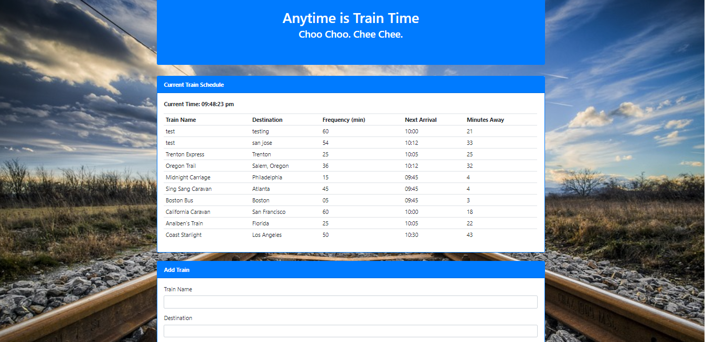

# Firebase Train-Scheduler

# Description
This is a train schedule application that incorporates Firebase to host arrival and departure data. This app has a form that allows users to enter information about any train including the name, destination, first train time, and frequency. When the submit button is clicked, the app then retrieves and manipulates this information with Moment.js. This website will provide up-to-date information about various trains, namely their arrival times and how many minutes remain until they arrive at their station.

# Built With
* HTML5
* CSS
* Bootstrap
* JavaScript
* JQuery
* Firebase API for Database
* Moment.js

# Author
Hallie Calhoun